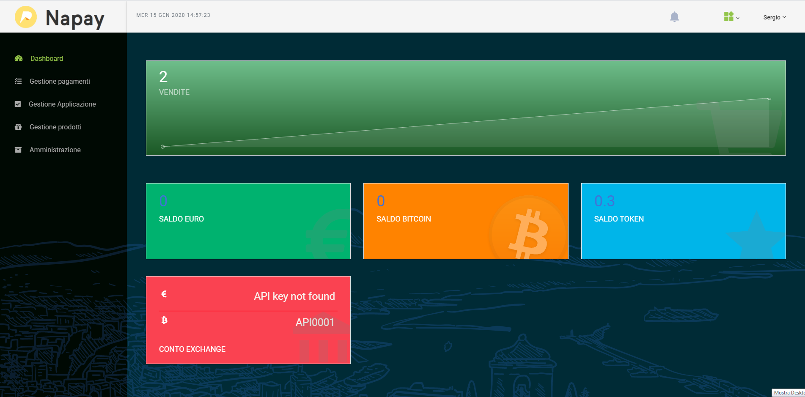
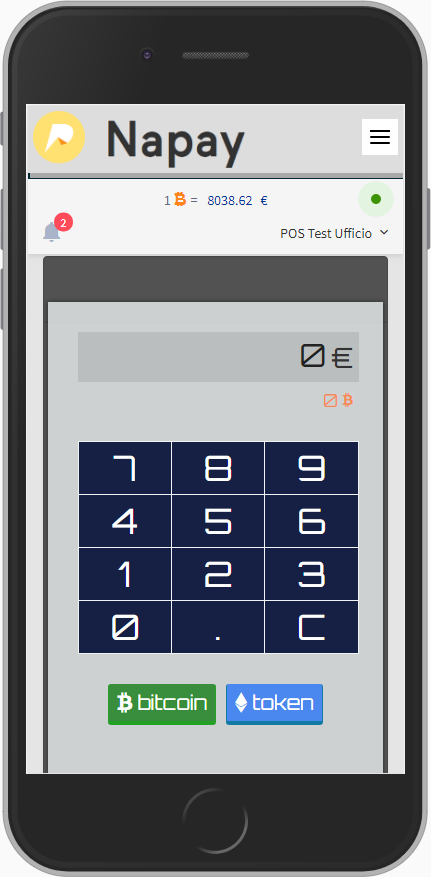

# Napay

### Progressive Web App - v. 1.4

Napay è un'applicazione web nata per gestire facilmente i pagamenti in bitcoiin e in TTS, il Token del Comune di Napoli.

### Authors

Made with :heart: ​by [Sergio Casizzone](https://sergiocasizzone.it)

## Indice

[Premessa](#premessa)

​		[Progetto Blockchain Napoli](#progetto-blockchain-napoli)

[Iscrizione Socio](#iscrizione-socio)

​		[Paga Quota Iscrizione](#paga-quota-iscrizione)

[Abilitazione Ricezione Bitcoin](#abilitazione-ricezione-bitcoin)

​		[Creazione Negozio](#creazione-negozio)

​		[Attivazione POS](#attivazione-pos)

[Abilitazione Ricezione Token TTS](#abilitazione-ricezione-token-tts)

[Utilizzo del POS](#utilizzo-del-pos)

[Dashboard](#dashboard)

​		[Header](#header)

​				Widget

​				Notifiche

​				Account Utente

​				Account commerciante

​				Impostazioni

[Gestione Pagamenti](#gestione-pagamenti)

​		[Transazioni](#transazioni)

​		[Transazioni Token](#transazioni-token)

​		[Notifiche](#notifiche)

​		[Conto Exchange](#conto-exchange)

[Gestione Applicazione](#gestione-applicazione)

​		[Negozi](#negozi)

​		[POS (Point of Sale)](#point-of-sale)

[Gestione Prodotti](#gestione-prodotti)

​		[Categorie ](#categorie)

​		[Prodotti](#prodotti)

[Amministrazione](#amministrazione)

​		[Quote associative](#quote-associative)

​		[Verbali](#verbali)

## Premessa

Napay (acronimo di Napoli Payments) è un software sviluppato all'interno del Progetto Blockchain Napoli da volontari e appassionati, di consolidata esperienza nei vari ambiti tecnologici (programmatori, sistemisti, ecc.), la cui sinergia ha fornito le basi per la creazione di un nuovo sistema di pagamento per le attività commerciali ed i professionisti.

### Progetto Blockchain Napoli

Nel mese di aprile 2018, il Comune di Napoli ha effettuato una chiamata pubblica per il reclutamento di volontari al fine di realizzare alcuni progetti in ambito blockchain e cryptovalute. A questa chiamata hanno risposto piú di 300 persone. Per quanto riguarda i pagamenti in cryptovaluta, si è formato un ristretto gruppo di tecnici il cui obiettivo è stato la realizzazione di un sistema di pagamento virtuale che permetta agli esercenti di accettare Bitcoin presso la propria attività.

L'Associazione Napoli Blockchain nasce sulla spinta dell’iniziativa del Comune di Napoli e si propone di:
- diffondere la conoscenza della Blockchain e delle cryptovalute
- aiutare i soci a creare un senso di consapevolezza sull'utilità di tali tecnologie nella vita
- promuovere la tecnologia Blockchain come veicolo per l'inclusione sociale, per il rafforzamento della partecipazione civica
- supportare il Comune di Napoli nello sviluppo, diffusione ed implementazione dell'utilizzo della Blockchain.

## Iscrizione Socio

1. Il commerciante che vuole diventare socio deve iscriversi attraverso il form di registrazione presente sul sito inserendo le informazioni necessarie richieste per la registrazione dell’utenza.

   Con l’iscrizione, l’utente:

   - conferma di aver letto lo ***Statuto***;

   - conferma di aver letto l'***INFORMATIVA SULLA PRIVACY*** e autorizza al trattamento dei dati personali;

   - accetta le ***Condizioni generali di utilizzo*** del software;

   - può acconsentire o meno al  ***trattamento dei dati per finalità di marketing***

   -  accetta i ***Termini e le Condizioni di utilizzo del POS***

     > [^]: I ***termini e le condizioni di utilizzo del POS*** riguardano **esclusivamente** i commercianti. Per i soci semplici, quest'autorizzazione non è richiesta.

2. L'iscrizione è subordinata all'accettazione da parte dei soci amministratori

3. Una volta approvata l'iscrizione, il socio, se non ha già provveduto al pagamento della quota associativa, provvederà al pagamento della stessa tramite la sezione `Paga Quota Iscrizione`

## Paga Quota Iscrizione

1. Per effettuare il pagamento della quota di iscrizione è necessario effettuare il login nella sezione apposita presente sulla pagina di login dell'applicazione. La quota di iscrizione è diversa nel caso in cui il socio sia un commerciante oppure no, ed è stabilita secondo lo Statuto dell'Associazione.
2. Il pagamento può avvenire tramite transazione in
   - Bitcoin
   - Paypal
3. Quando si effettua il pagamento, il socio viene abilitato all'utilizzo della procedura per un anno a partire dalla data di registrazione dell'operazione. Nel caso di pagamento effettuato prima della scadenza naturale, l'anno di validità viene aggiunto alla data di scadenza, non a quella in cui viene effettuata l'operazione.

## Abilitazione Ricezione Bitcoin

### Creazione Negozio

1. Per rendere operativo il software, cioè essere capaci di ricevere bitcoin, è necessario creare un Negozio a cui sia associato uno o più POS. Una volta cliccato nel menù su `Nuovo Negozio`, basta semplicemente indicare la denominazione, se l'indirizzo della sede del negozio combacia con quello inserito in fase di registrazione. Se invece gli indirizzi sono diversi, modificarli e poi confermare il salvataggio.

### Attivazione POS

1. Appena creato il Negozio, il software richiede se si vuole abilitare il POS. Ovviamente clicchiamo sul pulsante `Nuovo POS` e inseriamo:
   -  la descrizione del POS per identificarlo secondo l'organizzazione interna *(es. POS principale, POS piano terra, POS reparto 1, ecc…)*;
   -  la **Master Public Key (MPK)** del Wallet bitcoin. Se non si conosce il metodo di estrazione della MPK da un wallet, seguire la guida a questo link: [Guida estrazione MPK](https://napoliblockchain.it/esportare-la-chiave-pubblica-mpk-dal-wallet-coinomi/)
2. Dopo aver salvato queste informazioni, cliccare sul pulsante `Attiva POS`. Al termine di questa operazione, verranno mostrati 10 indirizzi bitcoin generati dall'applicazione web utilizzando la MPK dell'utente. Verificare che gli indirizzi generati corrispondano con quelli presenti sul proprio wallet per **certificare** la corretta abilitazione del POS.

## Abilitazione Ricezione Token TTS

Per ricevere il token TTS, bisogna prima di tutto accedere al wallet tramite il *link* presente nel *Widget* dell'applicazione **Napay**, oppure digitando direttamente questo URL [wallet.napoliblockchain.it](https://wallet.napoliblockchain.it/?r=wallet/index) nella barra degli indirizzi del browser dello smartphone.

Effettuare il login con le credenziali di accesso all'applicazione **Napay**. Se abbiamo abilitato la **Sicurezza a 2 Fattori per il Wallet TTS** nelle impostazioni utente, ci verrà richiesto anche il codice di controllo per proseguire.

Scegliere se generare un nuovo wallet o ripristinarne uno creato precedentemente. Se la scelta è quella di generare un nuovo wallet, scrivere immediatamente le parole del **seed** nello stesso ordine in cui vengono mostrate su un supporto cartaceo e conservarlo in un luogo **sicuro**. In caso di smarrimento, non è più possibile ripristinare e recuperare i fondi presenti su quell'indirizzo. Scaricare e stampare il modello tramite questo link: [Recovery Sheet](RECOVERY_SHEET.pdf)

## Utilizzo del POS

Collegarsi tramite il *link* presente nel *Widget* dell'applicazione **Napay**, oppure digitando direttamente questo URL [pos.napoliblockchain.it](https://pos.napoliblockchain.it/?r=site/login) nella barra degli indirizzi del browser dello smartphone.

Il codice **SIN** (Server-Initiated Pairing) che viene richiesto è il codice che è stato generato in fase di attivazione del POS e che è stato inviato anche sulla mail del commerciante. Possiamo recuperare questo codice anche all'interno dell'applicazione **Napay**, selezionando `POS` nel menù `"Gestione Applicazione"`.

Una volta effettuato il login avremo la schermata seguente:

Inseriamo l'importo da richiedere e clicchiamo su **"bitcoin"** se vogliamo essere pagati in cryptovaluta, altrimenti clicchiamo su **"token"** se vogliamo ricevere il **Token TTS**.

## Dashboard

La dashboard è la schermata principale dell’applicazione dove si possono controllare a colpo d’occhio alcune informazioni statistiche che sarà possibile verificare nel dettaglio nelle schermate successive.

Sulla dashboard visualizziamo:

- Vendite totali effettuate
- Saldo in euro da vendite
- Saldo bitcoin da vendite
- Saldo Token da vendite 
- Gli importi in euro e in bitcoin presenti sull’exchange utilizzato per il cambio in euro

### Header

- #### :green_book: ​Widget

  Nel widget sono visualizzati i link alle altre due applicazioni, il POS e il Wallet

- #### :bell: Notifiche

  Mostra le ultime tre notifiche e il numero totale da archiviare. Cliccando sulla singola notifica si accede alla transazione relativa. Cliccando invece su `"Vedi tutte le notifiche"`si accede alla funzione di archiviazione delle stesse. Selezionare le notifiche che si vuole archiviare e premere il pulsante `"Archivia notifiche"`

- #### :bust_in_silhouette: ​Account utente

  Mostra i dettagli dell'utente collegato ed è possibile modificarli. Mostra, inoltre, le autorizzazioni ai consensi e le date in cui sono stati concessi. E' possibile, infine, 

  - cambiare la password
  - abilitare/disabilitare la **Sicurezza a 2 Fattori per il Wallet TTS**
  - abilitare/disabilitare la ricezione dei messaggi **push**

- #### :construction_worker: Account commerciante

  Mostra i dettagli dell'account di commerciante collegato ed è possibile modificarli.

- #### :gear: Impostazioni

  Visualizza le impostazioni e ne permette la modifica. In particolare è possibile:

  - Inserire le chiavi API dell'exchange di riferimento. 
  - Inserire i propri dati Bancari. Devono corrispondere a quelli inseriti sull'azione per poter ricevere euro dalla compravendita dei bitcoin.

## Gestione Pagamenti

In questo menù sono racchiusi tutti i collegamenti ai comandi che servono a gestire i pagamenti dell’applicazione, dalle transazioni, alle fatture alla gestione del conto corrente.

### Transazioni

Con `“Lista transazioni”` è possibile visualizzare la lista di tutte le transazioni in bitcoin e lo stato in cui si trovano. Cliccando sulla singola transazione si possono visualizzare tutti i dettagli. 

Nella schermata dettagli, cliccando sul pulsante dello stato della transazione, il sistema verifica se ci sono stati cambiamenti nello stato della transazione. Questa funzione è utile soprattutto se la transazione si trova nello stato `"in corso..."` e sono trascorsi più di 15 minuti dalla sua creazione. 

E' possibile stampare la lista delle transazioni oppure estrarle in formato Excel.

### Transazioni Token

Con `“Transazioni Token”` è possibile visualizzare la lista di tutte le transazioni effettuate dal token,
sia tramite POS che dal Wallet e lo stato in cui si trovano. Cliccando sulla singola transazione si possono visualizzare tutti i dettagli.

Nella schermata dettagli, cliccando sul pulsante dello stato della transazione, il sistema verifica se ci sono stati cambiamenti nello stato della transazione. Questa funzione è utile soprattutto se la transazione si trova nello stato `"in corso..."` e sono trascorsi più di 15 minuti dalla sua creazione. 

E' possibile stampare la lista delle transazioni oppure estrarle in formato Excel.

### Notifiche

Con `“Lista Notifiche”` è possibile visualizzare la lista di tutte le notifiche ricevute non ancora visualizzate. Le notifiche si possono archiviare singolarmente o complessivamente, spuntando il checkbox relativo e cliccando sul pulsante `“Archivia notifiche”`.

### Conto Exchange

Se sono state inserite le chiavi API dell'exchange su cui vengono scambiati i bitcoin, è possibile effettuare direttamente dalla webapp la sola visualizzazione delle transazioni di compravendita effettuate. L’operazione non viene effettuata in automatico dal sistema, ma è necessario cliccare sul pulsante `“Aggiorna”` per effettuare il collegamento e scaricare la lista delle movimentazioni.

## Gestione Applicazione

In questo menù sono raccolti i comandi necessari al funzionamento dell’applicazione.

### Negozi

Con `“Negozi”` si gestiscono i negozi del commerciante. Non esiste un limite ai negozi che si possono creare.

### POS (Point of Sale)

Con `“POS”` si gestiscono i POS (Point of Sale) dei singoli negozi. Non esiste limite ai POS che si possono creare.

## Gestione Prodotti

In questo menù vengono gestiti i prodotti che il commerciante vuole visualizzare nel POS per desktop. 

### Categorie

Si possono creare tante *categorie* diverse di prodotti e associarle a ciascun **negozio**. Ogni **negozio** può avere le proprie *categorie* merceologiche.

### Prodotti

Si inseriscono i prezzi e le immagini dei *prodotti* da associare alla singola categoria merceologica.

## Amministrazione

### Quote associative

Lista dei versamenti effettuati all’Associazione. E' possibile stampare la lista, estrarre un file Excel, scaricare la ricevuta del pagamento.

### Verbali

Lista dei verbali dell'Associazione. E' possibile visualizzare il contenuto dei verbali di incontro dell'Associazione.

Il compito di caricare i verbali è affidato al socio con la carica di Segretario.

